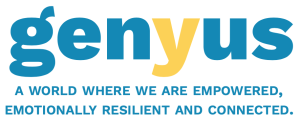

<h1 align="center">Genyus Network - Accessible Interface Repository</h1>

    

## Project Overview

Genyus Network is a global trauma survivor community and capacity-building platform. Trauma survivors from all over the world join through Genyus Network to share their stories, get support, be an example to others and become a part of this very inclusive home-like community. The Genyus Network aims to help trauma survivors and those who support them in increasing their capacity to live life after trauma. Caleb, the founder of Genyus Network, had the ambition to create a network for those who had been affected by trauma after suffering a stroke at the age of 24. Since then, it's been a thriving community.

We are team redback and will mainly be working on Aphasia friendly AI buttons.

- "Aphasia Friendly Button": A potential "alt-text" feature whereby blog authors and general posts could be given an "aphasia friendly" button that shows the simplified text. This was initially proposed as a manual task, but we will be implementing interesting NLP applications to automate this.

- "AI Driven Aphasia Friendly Button":  Further to the above point, will learn a vocabulary that users are comfortable with and use that to generate the "aphasia friendly" summaries. Might be out of scope, but very interesting.

Documentation: [Confluence](https://confluence.cis.unimelb.edu.au:8443/display/COMP90082UI/Team+Redback)

For Setting up the Wordpress on Local on Mac follow the below steps:

1. Clone the repository into your local machine.
2. Download and Install Mamp on your local machine
2. Go to the Mamp location, direct to htdocs as Mamp->htdocs. Copy the cloned repo 'genyus' into this htdocs location.
3. Open the 'wp-config.php' file provide the database name as 'wordpress' and dbusername and password as 'root'.
4. Run the server and go to your admin by typing phpmyadmin at the end ex. 'localhost:8888/phpmyadmin'. Create a new database name 'wordpress' and import the file 'wordpress.sql'. The database will be loaded into your localhost.
5. You can run the website by typing localhost:8888 and then by localhost:8888/genyus  

For Setting up the Wordpress on Local on Windows follow the below steps:

1. Clone the repository into your local machine.
2. Download and install wampserver. During installation note down the warning(download and install VS versions in orderly format shown in the warning)
3. After installation, restart the OS and rerun the wamp server. 
4. Note the wamp server icon color in the taskbar notification menu. Green == Running fine, Orange == limited services are running, red == not working or turned off.
5. If icon is green, Open your web browser. Type "localhost" in the url and hit enter. Localhost page wil appear.
6. In the localhost create new virtualhost by clicking "Add new virtual host".
7. Provide suitable name to your virtual host and the location of the cloned repository.
8. Again go back to localhost, click "phpmyadmin" to create/add database for the virtual host.(Do not change the username, password)
9. Create new database by clicking "New". Give suitable name to the DB. Select UTF8-general.
10. Import the db file 'wordpress.sql' and save changes. 
11. Locate and open the 'wp-config.php' file , change the db_NAME as'wordpress' and DB_USER as "root" and DB_PASSWORD as "root", DB_HOST as "localhost", save the file.
12. Go the localhost in your browser, hit created virtual host.
13. You can run the website by typing localhostname.